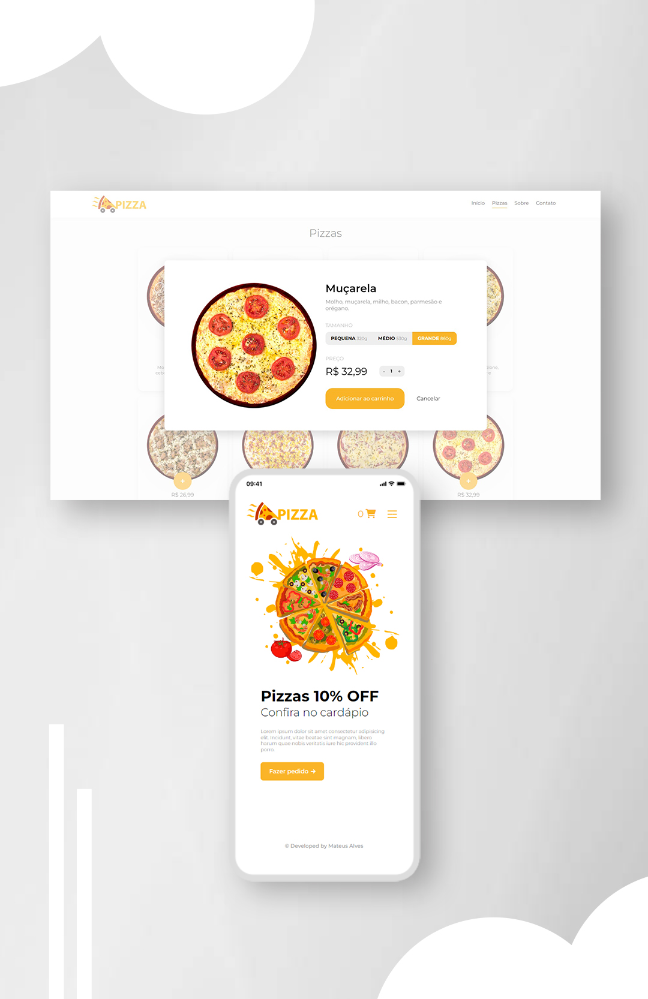

  <h1>Sistema de compra de pizzas</h1>

<h3>
  Projeto desenvolvido para portifólio pessoal.
</h3>
 

 <a href="#api">• Exemplo API de Pizzas</a> 
  
 <a href="#leng">• Skills utilizadas</a>
  
 <a href="#contato">• Contato</a>

 

<h1>Visão geral</h1>
Aplicação simulando um sistema de <strong>Pizzaria</strong>, onde é possível escolher o sabor da pizza desejada, tamanho e quantidade, tudo sendo calculado e exibido <strong>automaticamente</strong> em um modal na tela do usuário. As pizzas são obtidas através de uma requisição na API que contém todas as pizzas. Também foi trabalhado as funções de um carrinho de compras, onde é possível acrescentar ou remover a quantidade de pizzas, sendo <strong>calculado em tempo real</strong> o total que o usuário deve pagar, além de um modal confirmando o pedido.

 
 

<h1 align="center">
<a href="https://matealves.github.io/pizzaria/index.html" target="_blank">Testar</a> 
</h1>

  

 

